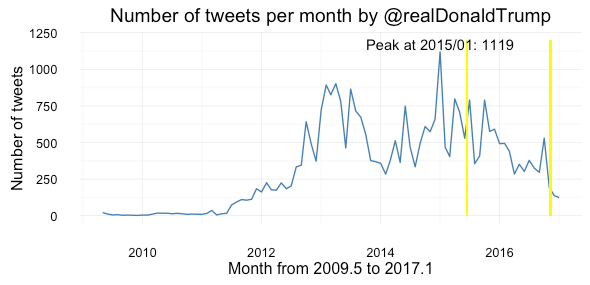
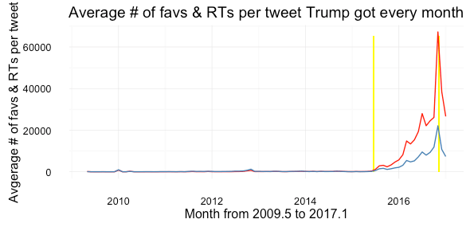
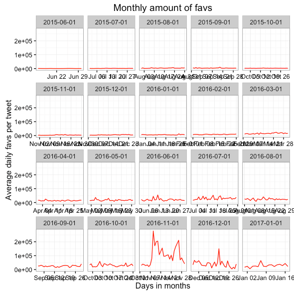
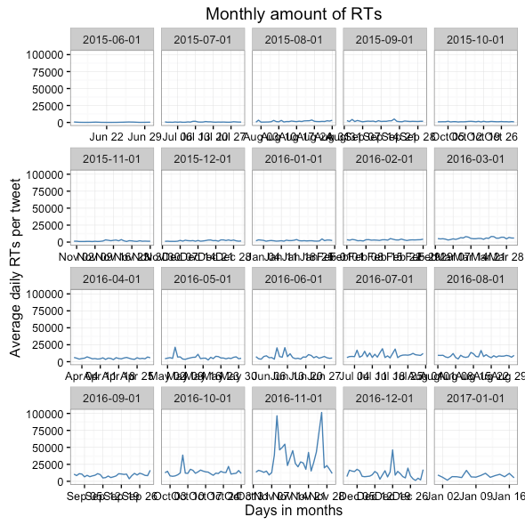
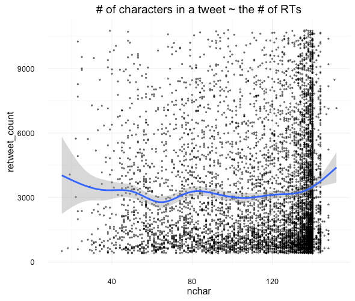
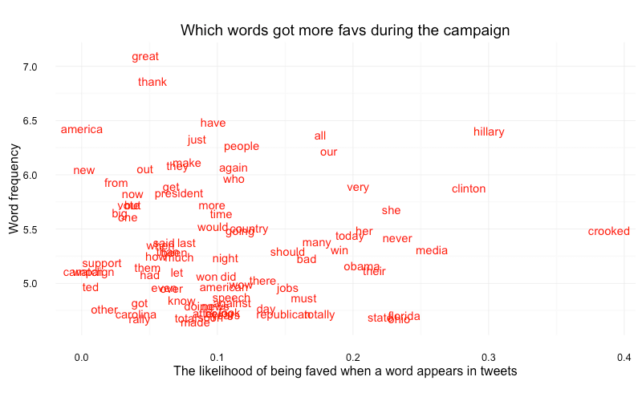
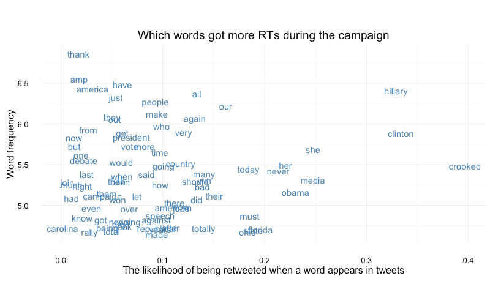

# How @realDonaldTrump tweeted

======

*@zhoyoyo, Jan 23, 2017*

## Background and data

[@realDonaldTrump](https://twitter.com/realDonaldTrump) probably won't be used as heavily as it has been since 2009, when Doanld J. Trump registered his Twitter account and started building his online presence. (Now in case you are interested, you should be following @POTUS.) However, the entire database of his tweets going back to 2009 has been archived and made searchable at <http://trumptwitterarchive.com/>. This project serves as a preliminary exploration of some of Trump's tweeting patterns, with a focus on identifying the elements that attracted Twitter users' attention throughout his 2016 presidential campaign. 

The data was downloaded from [the github page of Trump Twitter Archive](https://github.com/bpb27/political_twitter_archive/blob/master/realdonaldtrump/realdonaldtrump.csv).

 
## Data exploration and visualization

#### 1. Tweeting frequency

##### 1.1 By month, since he joined Twitter

Trump is an avid Twitter user much long before he announced candidacy; Not sure what happened in Jan 2015 without looking at the content of the Tweets more closely. 

##### 1.2 Tweeting frequency during the campaign and after he won the presidency

Trump tweeted more when he announced candidacy, during the first several primary debates (September to October 2015) and during the presidential debates (September to October 2016); he tweeted much less after winning the presidency.

##### 1.3 Retweeting frequency

Either data had missing values or Trump just did not retweet before 2016. It's more likely that the data does not count for retweets before 2016. This means `is_retweet` is not a metric to be used for any analysis before 2016.

#### 2. What kind of tweets got more favs and retweets?

Red: Favorites; Blue: Retweets.

##### 2.1 How many favs and rts did Trump got overtime?

People started favoring his tweets and retweeting after he announced candidacy in June 2015. For both favorites and retweets, three peaks occurred in March, July and November of 2016.

##### 2.2 Favs and RTs during the campaign and after he won the presidency.

A closer look at the favs and RTs during the campaign shows a similar uptick during November 2016 -- right after he won presidency.

##### 2.3 what kind of tweets got more favs and RTs? 

**2.3.1 Correlation to time of the day?**

Assuming Trump tweeted most of his tweets on the east coast (New York and Florida mostly), and not counting for the Day Time Saving during the winter, the biggest thing we see is that people sleep during night hours. The best time to maximize favorites and RTs is early morning, late afternoon and sometime before midnight.

**2.3.2 Coorelation to the number of characters in a tweet?**

Take a look at tweets whose counts of favs fall between 10% and 90% of the favorite counts of all tweets:

Take a look at tweets whose counts of RTs fall between 10% and 90% of the RT counts of all tweets:

While these two graphs show that most of Trump's tweets have a length close to the max 140 character limit, it doesn't show a clear correlation between number of characters in a tweet and people's reaction to tweets.

**2.3.3 Which words appeared more frequently in tweets with more favs and rts?**

Data processing steps:

* Tokenize words in a very rough way and get word frequency
* Assign weights to each word based on the retweets and favorites the tweet where the word is found received
* Filter out stop words
* Filter out words with fewer than 100 appearance (cutting words that only appear a few times)
* Filter to pick words that were faved or retweeted more than an average word was faved or retweeted.

Then I got 88 words with high frequency and higher-than-average favs, and 83 words with high frequency and higher-than-average retweets.

Here are two plots with log scales for both x and y axes:

We see some similar trends for RTs and favs. In general, Hillary Clinton, Crooked Media, Obama are high-frequency terms to trigger high retweets and favs. 

##### 2.4 Did people retweet and favor different content?

People are more likely to fav a tweet when it talks about Hillary Clinton, Obama, America, and tend to retweet a tweet when state names are involved, such as Carolina, Florida, Ohio:

 

-----
## Retrospect

The charts invovled here only serves as preliminary exploratory purpses. Without more rigorous analysis using techniques like POS, lemmatization, ngrams, it is hard to draw any solid conclusion. 

